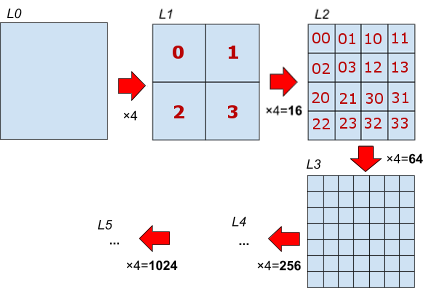
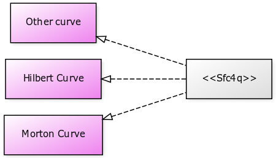
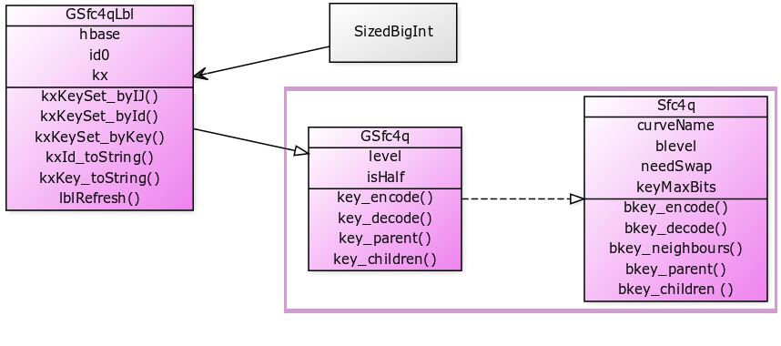

&nbsp; &nbsp; &nbsp; &nbsp; ([click here to online demonstration](https://osm-codes.github.io/Sfc4q/) for Desktop Firefox or Chrome)

# Sfc4q classes

*Space-filling curves*  (SFCs) can be used to index discrete grids, including the [Geospatial ones](http://docs.opengeospatial.org/as/15-104r5/15-104r5.html). Each cell in the grid is associated with an index, which can be produced by an SFC.  In this project, we are particularly interested in hierarchical grids with a recurring ​partition of quadrilateral cells in 4 regions​:

Therefore, we are interested in any SFC that is valid for indexing hierarchical grid of refinement-ratio-4 quadrilateral cells, abbreviated **SFC-4q**, or *Sfc4q* as adopted in the project's name and classes names.

In this project we are also interested in [geocodes](https://en.wikipedia.org/wiki/Geocode) obtained by labeling the SFC indexes,  expressing it in human-readable **hierarchical codes**. The hierarchy of the code is illustrated above as the commom prefix (e.g. `2` in `20` and `23`) that emerges in with the base4 representation.

## Framework organization

The framework can be used as simple standard interface for a set of SFC algorithms, like Hilbert, Morton or other.

The algorithms themselves are "concrete classes". But the standardization of basic methods, such as *endode()* and *decode()*, is not the issue, there are a lot of generic and reusable methods, so the best way is to extend a generic class with these reusable methods, and implement the concrete algorithm  as specialization. This project is a set of abstract and concrete classes.

Other important issue for SFC-4q is the generalization for "half levels" described in [this PDF article](https://zenodo.org/record/2536584). It is also independent of the concrete algorithms. The illustration bellou is hou these classes uas implemented:

* [**GSfc4q**](https://osm-codes.github.io/Sfc4q/docs/jsDocs/GSfc4q.html): the "Generalized Sfc4q" class.

* [**GSfc4qLbl**](https://osm-codes.github.io/Sfc4q/docs/jsDocs/GSfc4qLbl.html): a generaliation of GSfc4q,  to translate *key*, *bkey* and cell identifiers (cell IDs) into human-readable labels (lbl). To preserve hierarchy, this translation uses the concept of [Natural Codes](http://osm.codes/_foundations/art1.pdf), implemented in Javascript by the class SizedBigInt (of the project [osm-codes/NaturalCodes](https://github.com/osm-codes/NaturalCodes) and old [SizedBigInt](https://github.com/ppKrauss/SizedBigInt)).

* **GSfc4qLbl_Hilbert**: the "concrete class" that implements the [Hilbert curve](https://en.wikipedia.org/wiki/Hilbert_curve).

* **GSfc4qLbl_Morton**:the "concrete class" that implements the [Morton curve](https://en.wikipedia.org/wiki/Z-order_curve) (also  Z-order curve).

* [**SizedBigInt**](https://github.com/osm-codes/NaturalCodes): it is a complementar tool for use BigInt (mainly 64 bits unsigned integers) as hierarchical indexes and obtain its string representations, and an implementation of the Natural Codes.

See [classes documentation](https://osm-codes.github.io/Sfc4q/docs/jsDocs).

## The grid and D3 peparation classes

* [**GridOfCurve**](https://osm-codes.github.io/Sfc4q/docs/jsDocs/GridOfCurve.html)

* [**GridOfCurve_D3**](https://osm-codes.github.io/Sfc4q/docs/jsDocs/GridOfCurve_D3.html)

## LICENSE

Content, data and algorithms: **CC0 1.0**,  Public Domain Dedication.

